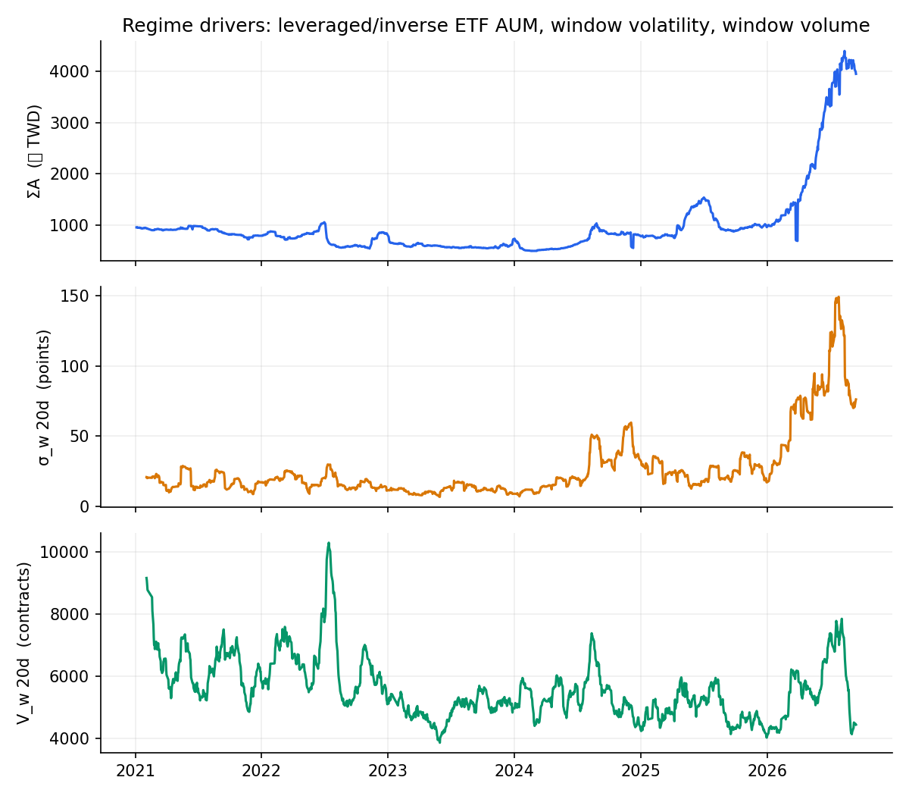
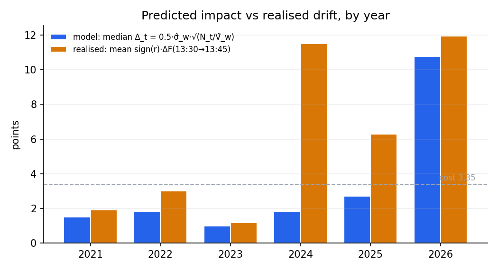
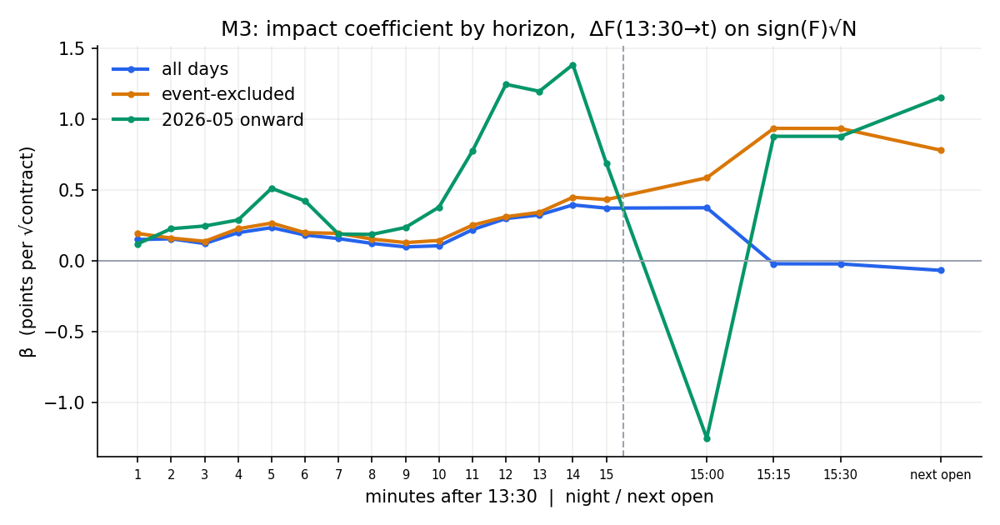

# 槓反 ETF 尾盤再平衡與台指期 13:30–13:45 的衝擊

> 台灣的正2 / 反1 ETF 每天收盤要把曝險拉回目標倍數，再平衡量是 2·r·ΣA，方向跟當天漲跌同向。現貨 13:25 進入集合競價，13:30 收盤後加權指數凍結，但台指期繼續交易到 13:45。
> 這個專案問三件事：ETF 是不是真的用期貨做這件事、流量是不是落在 13:30–13:45、期貨在那十五分鐘有沒有被推動。三個都用公開資料檢定，最後老實算出扣成本後的策略價值與容量。

**資料**：2021-01 ～ 2026-09，1,354 個交易日（台指期主力合約秒級成交、八檔槓反 ETF 每日單位數與收盤價、投信期貨未平倉、加權 5 秒指數、台積電逐筆）　**工具**：Python / polars / statsmodels　**狀態**：三階段檢定完成，捕獲率 κ 需小量實盤測量

| 主檢定 M1：13:30→13:45 期貨變動 對 sign(F)·√N | 再平衡工具 | 提前定價 | 扣成本策略（2026，κ 情境 0.5） |
|---|---|---|---|
| β = 0.37 點/√口，HAC t = 4.8，n = 1,346 | 期貨，行為版 θ = 0.79 / 0.83 | 13:25→13:30 無，t = 0.9–1.5 | 每口淨 17 點，Sharpe 2.4，前 10 天佔利潤 108% |

---

## 1. 為什麼要測：機制推導

L 倍槓桿 ETF 每日收盤必須把曝險拉回 L 倍淨值。設前一日淨值 $A$、曝險 $E = LA$，當日標的報酬 $r$：

$$E' = LA(1+r), \qquad A' = A(1+Lr), \qquad E^* = LA' = LA(1+Lr)$$

$$\Delta E = E^* - E' = L(L-1)\,A\,r$$

$g(L) = L(L-1)$ 滿足 $g(2) = g(-1) = 2$：正2 與反1 的再平衡量相同、方向相同，可以直接相加。八檔 ETF 的總流量

$$F_t = 2\, r_t \sum_i A_{i,t-1}$$

換算成台指期口數（乘數 $m = 200$，$\theta$ = 期貨曝險佔總曝險的比例）：

$$N_t = \theta \cdot \frac{2\, r_t\, \Sigma A_{t-1}}{I_t \cdot m}$$

三個性質讓它成為 forced flow：

- **方向可推**：$r_t$ 在 13:29 由試撮價近乎確定，$A_{t-1}$ 前一晚公告，不是預測。
- **時間精確**：ETF 要貼 13:30–13:45 的期貨均價才能鎖住追蹤誤差。
- **對價格不敏感**：他們的目標是曝險倍數，不是成交價。

若流量真的在那十五分鐘進場，平方根衝擊律給出期貨被推動的量：

$$\Delta = Y \cdot \sigma_w \cdot \sqrt{N / V_w}$$

$\sigma_w$ 是窗口報酬標準差（點），$V_w$ 是窗口成交口數，$Y$ 是衝擊係數。成本 $c$ 設 3.35 點（2 tick 價差 + 稅 + 手續費），打平的臨界報酬

$$|r^*| = \frac{I\, m\, V_w}{2\,\theta\,\Sigma A}\left[\frac{c}{\kappa Y \sigma_w}\right]^2$$

其中 $\kappa$ 是實際能抓到的衝擊比例，回測估不出來，只能實盤量。

### 研究設計：三階段，任一關不過即停

| 階段 | 內容 | 停止條件 |
|---|---|---|
| 1 參數實測 | 用真實資料取代六個假設值：$V_w, \sigma_w, \Sigma A, \theta, Y$, spread | 重算 $\Delta < 5$ 點 |
| 2 前提檢定 | P1 再平衡走期貨還是現股；P2 流量是否落在窗口；P3 試撮期間是否已提前定價 | 任一關不過 |
| 3 主檢定 | M1 衝擊估計；M2 反轉；M3 衰減形狀；M4 容量 | — |

出場窗口在看資料前預先登記兩個：13:35 與 13:45。排除規則也預先定死：結算前三日、月底季底、摩台結算日、MSCI 季調日、台積電營收日 ±1、鴻海營收日、台積電法說、長假前。全樣本與排除版都跑，比較 β。

---

## 2. 第一階段：參數實測

| 參數 | 假設值 | 實測值 | 說明 |
|---|---|---|---|
| $V_w$ | 3,000 | 5,612（median 5,150） | 13:30–13:45 主力合約口數 |
| $\sigma_w$ | 40 點 | 全樣本 36；2026 84（穩健 58） | 逐年 std 18 / 18 / 12 / 31 / 25 / 84 |
| $\Sigma A$ | 3,000 億 | 最新 4,181 億；2021–25 年均 590–1,010 億 | 正2 3,899 + 反1 283 |
| $\theta$ | 78.4% | 0.87（水準迴歸）；行為版 0.79 / 0.83 | 見 P1 |
| $Y$ | 0.5 | 0.39–0.65，取 0.5 | 大單事件版 |
| spread | 2 tick | 1（2021–23）、2（2024–25）、3.5（2026） | 由成交跳動推估 |



$\Sigma A$ 的時序變異是後續識別的唯一來源：反1 從 2020 年 872 億縮到 283 億，正2 從 136 億長到 3,899 億，而 $V_w$ 五年幾乎沒變。

**$Y$ 的估法**：以「單筆最大成交 ≥ 30 / 50 / 100 口」的秒為事件，$\Delta P = \text{mid}(t+h) - \text{mid}(t-1s)$，用同時段前 20 日典型 $h$ 秒波動與成交量正規化，迴歸 $\Delta P/\sigma$ 對 $\sqrt{Q/V}$。六種設定 $Y$ 在 0.39–0.65。用窗口買賣淨量的版本 $Y \approx 2.5$，但 tick-rule 分類跟價格變動是同一件事，判定為套套邏輯，不採用。

**重算 $\Delta$（2026 參數，$\theta$ 0.87、$Y$ 0.5）**：$|r| = 1\%$ → 17 點；每日序列 2026 中位 13 點，2021–2025 只有 1–3 點。門檻通過，但只靠 2026 的制度。

---

## 3. 第二階段：三個前提

### P1 再平衡工具：期貨

$$\Delta(\text{投信期貨名目})_t = \alpha + \beta \cdot 2A_{t-1} r_t + \delta \cdot \text{申贖}_t + \varepsilon$$

| 設定 | β | HAC SE | t | n | R² |
|---|---|---|---|---|---|
| 正2 期貨多單，含申贖控制 | 0.805 | 0.148 | 5.5 | 1,346 | 0.40 |
| 正2 再加 $r$ 本身當控制 | 0.801 | 0.220 | 3.6 | 1,346 | 0.40 |
| 反1 期貨空單，含申贖控制 | 0.864 | 0.044 | 19.7 | 1,346 | 0.46 |

$r$ 本身的係數是 0，β 是從 $A$ 的時序變異識別出來的，不是投信順勢加碼。$y_{t\pm1}$ 對 $x_t$ 不顯著，流量當天完成。行為版 $\theta$：正2 0.79、反1 0.83，跟 00631L 帳面 78.4% 吻合。

### P2 流量落點：13:30–13:45，但不是一次打進去

直接跑 $V_w = \alpha + \beta_1 N + \beta_2 N^2 + \gamma\sigma_t$，$\beta_1 = 3.9$，可是 placebo 窗口（13:10–13:25、12:00–12:15）也有 3.0，大漲大跌日到處都放量。同日差分才乾淨：

| 差分窗口 | β₁ | t | n |
|---|---|---|---|
| (13:30–13:45) − (13:10–13:25) | 2.65 | 4.2 | 1,346 |
| (13:30–13:35) − (13:20–13:25) | 0.60 | 4.3 | 1,346 |

超額量是 $N$ 的 2.65 倍，其他人跟著交易讓成交量超過一比一。頭 5 分鐘只佔 23%，比均勻的 33% 還少：ETF 是平均攤開甚至後段偏重。

### P3 擁擠度：13:25–13:30 沒有提前定價

$$\Delta\text{basis}(13{:}25 \to 13{:}30) = \alpha + \beta_1 \hat r_t + \beta_2\, \text{sign}(F)\sqrt{N} + \varepsilon$$

| 被解釋 | β(sign F·√N) | t | n |
|---|---|---|---|
| 13:25→13:30 basis，全 | 0.075 | 1.5 | 951 |
| 13:25→13:30 basis，排除版 | 0.094 | 1.6 | 493 |
| 13:30→13:45，全 | 0.352 | 3.4 | 951 |
| 13:30→13:45，排除版 | 0.330 | 2.9 | 493 |

副產品：收盤 surprise $\hat r = I_{close} - I_{13:25}$ 的 std 52 點，期貨在 13:25–13:30 只跟了 37%，隔天開盤回吐 30%。集合競價本身噪音很大，期貨不理它是對的。

---

## 4. 第三階段：衝擊、反轉、形狀、容量

### M1 衝擊估計

$$\Delta F(13{:}30 \to \text{出場}) = \alpha + \beta \cdot \text{sign}(F_t)\sqrt{N_t} + \text{controls} + \varepsilon$$

| 出場 | 樣本 | β | HAC SE | t | n | R² | Δ @ N 中位 651 口 |
|---|---|---|---|---|---|---|---|
| 13:45 | 全 | 0.373 | 0.078 | 4.8 | 1,346 | 0.037 | 9.5 點 |
| 13:45 | 排除版 | 0.433 | 0.101 | 4.3 | 710 | 0.057 | 11.1 點 |
| 13:45 | 2026-05 起 | 0.690 | 0.382 | 1.8 | 88 | 0.042 | 17.6 點 |
| 13:35 | 全 | 0.235 | 0.050 | 4.7 | 1,346 | 0.040 | 6.0 點 |

排除版 β 不降反升，訊號不是事件偽造的。用模型自己的單位跑 $\Delta F/\hat\sigma_w$ 對 $\sqrt{N/\hat V_w}$，$Y_{eff} = 0.94$（t 6.5），各制度 0.6–1.0，跟大單實測的 0.5 同量級。

**歸因的弱點**：$\text{sign}(F)\sqrt{N}$ 與 $\text{sign}(r)\sqrt{|r|}$ 幾乎共線，只能靠 $A$ 跨制度的變化拆。加上後者當控制，β 在全樣本反號、各年份內不顯著。$A$ 真正變大只有 2026-05 之後的 88 天。

### 用日內特徵拆歸因

如果 13:30 後的漂移是一般的尾盤動能，它應該跟日內路徑有關。結果相反：

| 特徵 | 13:30→13:45 t | 13:10→13:25 placebo t |
|---|---|---|
| 當日報酬 $r$（收盤對前收） | 4.7 | −0.7 |
| 開盤跳空 | 3.6 | −2.4 |
| 台積電當日報酬 | 4.7 | −1.1 |
| 最後 60 / 30 / 15 / 5 分鐘動能 | 1.5 / 0.8 / 1.0 / 0.5 | 7.1 / 9.2 / 12.0 / −1.4 |
| 台積電收盤競價 surprise | 0.4 | 0.4 |

日內動能在 13:25 前很強，13:30 後消失；13:30 後只剩「今天收盤對前收漲跌多少」有效，連早上 8:45 就知道的跳空都算。只看這個數字的人，就是照 $2Ar$ 平衡的人。這是支持機制最強的一條證據，不需要 $A$ 的時序變異。



各年模型預測的中位 $\Delta$ 跟實際順 $r$ 方向的漂移：2021–2023 與 2026 吻合；2024 實際遠超預測，那一年的 edge 多半來自別的東西（八月崩盤那類極端日）。

### M2 反轉

夜盤 15:30 與次日開盤對 $\text{sign}(F)\sqrt{N}$ 全部 t < 1，隔夜噪音是衝擊的十倍以上。2026-05 起 13:45→夜盤 15:00 開盤 β = −1.94（t −3.6），高 $N$ 三分位平均回吐 91 點，方向符合暫時性衝擊，但 n = 30。

### M3 衰減形狀



- 峰值在 13:44，不是 13:36。5 分鐘出場只抓到 15 分鐘的 63%，成本固定，所以 13:45 出場淨 edge 較大。
- 9–10 分鐘有回落，13:41–13:44 再推。最後一分鐘佔窗口成交量 18%，是十五分鐘裡最大的。
- 13:44→13:45 那一分鐘在 2021–2025 每年都是順 $r$ 方向 +1 到 +3.6 點（t 3–5），只有 2026 是 −9.1 點（t −2.7）。所以「13:44 出場」的優勢是 2026 特有且事後挑選的，不採用。

### M4 容量

自身進出的衝擊是 $x^{3/2}$ 階，收益是 $x$ 階：

$$P(x) = x(\kappa\Delta - c) - \frac{2Y\sigma_w}{\sqrt{V_w}}\, x^{3/2}, \qquad x^* = V_w\left[\frac{\kappa\Delta - c}{3Y\sigma_w}\right]^2, \qquad P(x^*) = \tfrac{1}{3}\, x^*(\kappa\Delta - c)$$

2026-05 起參數（$V_w$ 5,987、$\sigma_w$ 99、$\Delta$ 17.6）：

| κ | 可交易日 | x* 中位（口） | x* 最大 | 年化（萬 TWD） |
|---|---|---|---|---|
| 1.0 | 99% | 56 | 586 | 3,646 |
| 0.7 | 93% | 25 | 270 | 1,054 |
| 0.5 | 89% | 10 | 126 | 303 |
| 0.3 | 81% | 2 | 37 | 36 |

$P \propto (\kappa\Delta - c)^2$：edge 縮三成，損益掉七成。

---

## 5. 當成策略：門檻 + 部位

規則全部 13:29 可知：$\Delta_t = 0.5\,\hat\sigma_w\sqrt{N_t/\hat V_w}$（$\hat\sigma, \hat V$ 用前 20 日），$\kappa\Delta_t > 3.35$ 才做，口數 $x^*_t$，13:30 第一筆進、13:45 出。本金 1,000 萬、保證金 6% 名目（假設）。Sharpe 用日報酬（未交易日算 0）× √252、扣成本。

門檻把它變成幾乎只在 2026 交易的策略：2021–2025 五年合計只挑出 4–33 天。

| 版本 | 期間 | 交易日 | 勝率 | 每口淨均 | Sharpe | 年化 | MaxDD | 前 10 天佔利潤 |
|---|---|---|---|---|---|---|---|---|
| 固定 1 口，κ=0.5 | 2026 | 105 (65%) | 57% | 17.2 點 | 2.60 | 5.8% | −1.3% | 108% |
| 固定 1 口，κ=0.5 | 2025–26 | 109 (27%) | 56% | 16.7 點 | 1.64 | 2.3% | −1.3% | 107% |
| x* 部位，κ=0.5 | 2026 | 90 (56%) | 58% | 17.7 點 | 2.38 | 71% | −9.2% | 119% |
| x* 部位，含自身衝擊 | 2026 | 90 | 58% | | 1.94 | 54% | | |

前 10 天超過 100% 代表其他 80 天合計小負。這不是每天都做造成的，門檻版也一樣。流量正比於 $r$、衝擊正比於 $\sqrt{\text{流量}}$，大部分期望值天生就在 $|r|$ 很大的日子。

**什麼制度下才有得做**（κ = 0.5 打平需要 $\Delta > 6.7$ 點，反推所需 $\Sigma A$）：

| $\sigma_w$ 制度 | 對應年份 | 1% 日子打平所需 ΣA | 2% 日子 |
|---|---|---|---|
| 12–18 點 | 2021–2023 | 1.6–3.5 兆 | 0.8–1.8 兆 |
| 25 點 | 2025 | 約 8,000 億 | 約 4,000 億 |
| 84 點 | 2026 | 約 700 億 | 約 350 億 |

波動回落它就休眠，門檻會自動說不要做。它不是能長期倚賴的現金流，是高波動制度下才會醒來的附屬交易。

---

## 6. 結論

**機制成立、edge 有條件、捕獲率未知、分布集中。**

1. 五條獨立證據：投信當天在期貨端照 $2Ar$ 平衡（θ 0.8，前後一天都沒有）；流量落在 13:30–13:45（差分 β₁ 2.65）；13:25 前無提前定價；13:30 後的漂移只跟收盤對收盤報酬有關、跟日內路徑無關；各年 edge 大小隨 $\Sigma A \cdot \sigma_w$ 一起變。
2. $\Delta \propto \sigma_w\sqrt{\Sigma A\,|r| / (I\,V_w)}$，成本固定。$\Sigma A$ 低於 1,000 億的年份淨損益是負的；現在 4,000 億時 Δ 中位 13–18 點。$\Sigma A$ 與 $\sigma_w$ 是每日監控指標，ETF 縮回去策略自動失效。
3. κ 回測估不出。帳面 κ=0.5 每天約 10 口、年化約 300 萬；κ=0.7 約 1,000 萬。
4. 利潤集中在極端 $|r|$ 日，實盤會是長期打平、幾天大賺的形狀，部位要按這個分布設計。

### 檢定力：三件事要分開

| | 可否檢定 | 結果 |
|---|---|---|
| (a) 流量是否存在 | 可 | P1、P2 通過 |
| (b) 衝擊 Δ 多大 | 可 | M1 t = 4.8 |
| (c) 能抓到多少 κ | 不可回測 | 需小量實盤 |

淨 edge 若為 κΔ − c 且 $\sigma_w$ 約 99，κ = 0.5 時單筆 Sharpe 約 0.05，要 t = 2 需 1,300 個交易日。直接回測進出場損益證明不了它，重心必須放在 M1。

### 未解決

- 2024 年實際漂移遠超模型預測的來源。
- 正2 現股端的 θ（需投信每日 PCF 歷史）。
- 流量 vs 動能的歸因只有間接證據，直接檢定要等 $\Sigma A$ 大的樣本累積。
- 13:44→13:45 那一分鐘在 2026 反轉的原因。

### 下一步

每天 2–5 口，13:30 進、13:45 出，記錄成交價對 13:30 第一筆的滑價，三個月估 κ。每日記 $\Sigma A$ 與 $\sigma_w$。

---

## 7. 資料與假設值

**資料來源**：台指期逐筆（FinMind TaiwanFuturesTick，聚合成秒 bar，口數已對期交所日量驗證）；八檔 ETF 發行單位數（TaiwanStockShareholding）與收盤價（TaiwanStockPrice）；投信期貨未平倉（三大法人）；加權 5 秒指數（TaiwanVariousIndicators5Seconds）；台積電逐筆（TaiwanStockPriceTick）。

**明確標註的假設值**：收盤價當 ETF 淨值代理；八檔全用加權指數報酬（00631L / 00632R 追蹤台灣50）；$Y = 0.5$；$c = 3.35$ 點；κ 三個情境；spread 為成交跳動推估；投信未平倉當 ETF 期貨部位代理（含非 ETF 投信，只含大台）；保證金 6% 名目。

**踩坑紀錄**：第一版 $A_{t-1}$ 的 shift 在 join 之後做，join 打亂了順序，整批 lag 是錯的。修正後 Stage 1 的 Δ 日序列與 Stage 2 全部重跑，結論方向不變但數字全換。

## 8. 檔案

```
code/
  00_dl_taiex5s.py       加權 5 秒指數補抓（13:20 後）
  01_params.py           Stage 1 參數實測
  02_stage2.py           P1 / P2 / P3 + 排除日曆
  03_stage2_diag.py      r 控制、placebo 窗口、流量 vs 動能識別
  04_stage3.py           M1 / M2 / M3 / M4
  05_stage3_norm.py      M1 正規化版
  06_drift_features.py   日內特徵歸因
  07_backtest.py         門檻 + 部位回測
  make_figures.py
results/                 各階段完整表格（markdown）與交易明細
figures/
```
